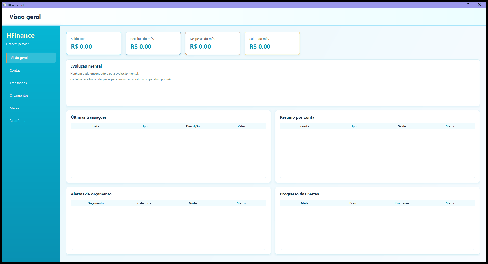

# HFinance

[](https://github.com/heraoliveira/HFinance/actions/workflows/ci.yml)
[](https://github.com/heraoliveira/HFinance/releases)


**Solução desktop para finanças pessoais**

HFinance surge como uma solução desktop local para organização de finanças pessoais, criada para substituir planilhas e controles manuais por uma experiência clara, visual e em português brasileiro. A aplicação centraliza contas, receitas, despesas, orçamentos, metas financeiras e relatórios exportáveis para apoiar o acompanhamento do dinheiro no dia a dia.

Versão atual: **1.2.0**.

## Demonstração



## Funcionalidades

- Cadastro, edição, inativação e exclusão permitida de contas.
- Cadastro, edição, exclusão, filtros avançados e recorrência de transações.
- Categorias padrão inseridas automaticamente na primeira execução e CRUD de categorias personalizadas.
- Orçamentos mensais por categoria de despesa, com gasto e status calculados.
- Metas financeiras com progresso e status automático.
- Visão geral com cards, gráficos mensais, despesas por categoria, últimas transações, contas, alertas e metas.
- Relatórios com filtros preservados na sessão, gráficos, cards de resumo e exportação para Excel `.xlsx` e CSV.
- Exportações com UTF-8, nomes seguros com timestamp, autofiltro e cabeçalho congelado no Excel.
- DatePicker estilizado com contraste adequado para mês, ano e dias do calendário.
- Ícone em ciano e dourado com H maior para janela, barra de tarefas e empacotamento Windows.
- Área **Sobre** com backup manual, abertura das pastas de dados, backups e logs, e exportação de diagnóstico.
- Persistência local em SQLite com migrations Flyway, validação de integridade e backup automático antes de migrations em bancos existentes.

## Stack

- Java 17 LTS
- JavaFX 17
- Maven
- SQLite e JDBC
- Flyway
- Apache POI
- JUnit 5, AssertJ, Mockito e JaCoCo
- GitHub Actions
- `jpackage`

## Arquitetura

O projeto usa camadas proporcionais a uma aplicação desktop:

- `domain`: entidades, enums e regras centrais.
- `application`: DTOs e services.
- `infrastructure`: repositories JDBC, migrations e exportadores.
- `ui`: JavaFX, controllers, componentes, navegação e viewmodels.
- `core`: configuração, caminhos, banco, backups, logs, diagnóstico, erros e formatação.

A interface chama services. Services aplicam regras de negócio. Repositories executam SQL com `PreparedStatement`. SQL não fica na UI e regra financeira não fica em controllers JavaFX.

## Dados Locais

O HFinance é local e offline. No Windows, o banco oficial do usuário final fica em:

```text
%APPDATA%/HFinance/hfinance.db
```

A estrutura completa do diretório de dados é:

```text
%APPDATA%/HFinance/
├── hfinance.db
├── backups/
├── logs/
├── exports/
└── config.properties
```

Em ambientes de desenvolvimento fora do Windows, a aplicação usa um diretório previsível dentro do perfil do usuário, como `~/.hfinance`.

Versões anteriores podiam usar `data/hfinance.db`. Esse caminho agora é tratado apenas como banco legado.

Fluxo de migração segura:

1. A aplicação procura o banco oficial em `%APPDATA%/HFinance/hfinance.db`.
2. Se encontrar apenas o banco legado em `data/hfinance.db`, cria backup.
3. Copia o banco legado para o novo local.
4. Valida a cópia.
5. Usa o banco novo.
6. Não apaga o banco legado automaticamente.

## Backups, Logs e Diagnóstico

- Backups automáticos são criados antes de migrations pendentes em bancos existentes.
- Backups manuais ficam disponíveis em **Sobre > Fazer backup agora**.
- Backups ficam em `%APPDATA%/HFinance/backups`.
- Logs ficam em `%APPDATA%/HFinance/logs`, incluindo `hfinance.log`, log diário e `hfinance-error.log`.
- Diagnósticos são exportados por **Sobre > Exportar diagnóstico** para `%APPDATA%/HFinance/exports`.
- O diagnóstico contém metadados técnicos e últimas linhas de log, sem exportar dados financeiros sensíveis intencionalmente.

## Regras Principais

- Valores monetários usam `BigDecimal`.
- Datas usam `LocalDate` e `LocalDateTime`.
- Conta ativa tem nome único.
- Conta inativa não recebe novas transações.
- Saldo atual não é armazenado; ele é calculado por saldo inicial + receitas - despesas.
- Orçamento só aceita categoria de despesa ativa.
- Categoria ativa tem nome único por tipo, ignorando maiúsculas, minúsculas e espaços extras.
- Categoria usada em transações ou orçamentos deve ser inativada em vez de excluída fisicamente.
- Transações recorrentes geram ocorrências individuais no cadastro, com limite seguro de 120 ocorrências.
- Meta concluída, atrasada ou em andamento é calculada pelo valor atual e prazo.
- Relatórios vazios não são exportados sem aviso.

## Executar em Desenvolvimento

Pré-requisitos:

- JDK 17 no `PATH`
- Maven no `PATH`

Execute:

```powershell
.\scripts\run-dev.ps1
```

Ou diretamente:

```powershell
mvn javafx:run
```

## Testar

Execute:

```powershell
mvn test
```

Para compilar e empacotar o JAR:

```powershell
mvn package
```

O relatório JaCoCo é gerado em `target/site/jacoco`.

## Empacotar no Windows

O script usa `jpackage` do JDK 17 e WiX para gerar os artefatos Windows:

```powershell
java -version
mvn -version
jpackage --version
wix --version
```

```powershell
.\scripts\package-windows.ps1
```

Ele valida Java 17, Maven, `jpackage` e WiX, executa `mvn clean package`, usa o ícone do projeto e gera:

```text
target/package/HFinance/HFinance.exe
target/release/HFinance-v1.2.0-windows.zip
target/release/HFinance-Setup-v1.2.0.exe
```

O ZIP portátil permite executar a aplicação sem instalador. O instalador Windows `.exe` integra o HFinance ao Windows, cria atalho no Menu Iniciar e usa a versão `1.2.0`.

Ao desinstalar o HFinance, os dados financeiros locais permanecem em `%APPDATA%/HFinance`, salvo remoção manual explícita pelo usuário.

## Como Usar

1. Abra o HFinance pelo `HFinance.exe` ou execute a aplicação em ambiente de desenvolvimento.
2. Cadastre ao menos uma conta em **Contas**.
3. Revise ou crie categorias em **Categorias** quando precisar personalizar receitas e despesas.
4. Cadastre receitas e despesas em **Transações**.
5. Use recorrência em **Transações** para gerar parcelas, assinaturas ou receitas futuras com limite definido.
6. Acompanhe saldo e evolução em **Visão geral**.
7. Cadastre limites em **Orçamentos**.
8. Cadastre objetivos em **Metas**.
9. Use **Relatórios** para filtrar, visualizar gráficos e exportar dados.
10. Use **Sobre** para criar backup manual, abrir pastas técnicas ou exportar diagnóstico.

## Versionamento e Branches

- `main`: desenvolvimento normal e releases aprovadas.
- `release/1.x`: correções seguras para usuários atuais.
- `develop`: opcional para mudanças maiores.

Política de versionamento:

- `1.0.x`: correções de bug.
- `1.1.x`: melhorias pequenas sem quebrar dados.
- `1.2.x`: melhorias maiores, ainda desktop local.
- `2.0.0`: mudança estrutural relevante, como API obrigatória ou arquitetura nova.

Hotfixes da linha 1.x devem partir de `release/1.x`:

```bash
git checkout release/1.x
git checkout -b hotfix/1.x-descricao-curta
```

## Limitações da Linha 1.x

- Não conecta com bancos reais.
- Não importa extrato automaticamente.
- Não possui login.
- Não possui sincronização em nuvem.
- Não possui aplicativo mobile.
- Não usa Spring Boot, API REST, PostgreSQL, Hibernate ou JPA.
- Não substitui software contábil profissional.
- Cartão é apenas método de pagamento.
- Dados ficam locais no computador do usuário.
- Não há multiusuário.

Mudanças como API obrigatória, nuvem, aplicativo Android, autenticação e nova arquitetura ficam reservadas para `2.0.0` ou superior.
